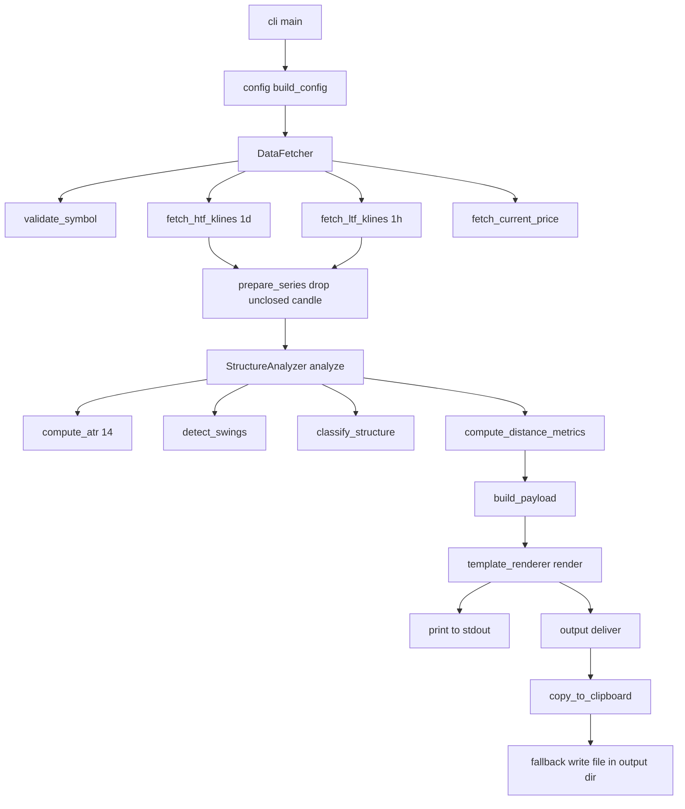

# SMC-Prompt — Design Specification

- **Artifact:** `docs/DESIGN_SPEC.md`
- **Tool:** `smc-prompt`
- **Status:** Design frozen for implementation (Code phase)
- **Scope of this document:** DESIGN ONLY. No production code is defined or generated here.
- **Target platform:** Python 3.10+, Windows / macOS / Linux

---

## 1. Executive Summary

`smc-prompt` is a single-run CLI that pulls OHLC data from the Binance public REST API (no API key), computes only **objective, mechanical structural facts** (the `[FAKTA]` layer), injects those facts into a fixed prompt template, prints the final prompt to the terminal, and copies it to the system clipboard.

The tool is a **data-preparation utility for a downstream text LLM**. It performs zero reasoning of its own. Every non-trivial interpretation (DOL, liquidity sweeps, bias, entry confirmation) is deliberately delegated to the LLM reading the rendered prompt.

### 1.1 The two-layer payload (critical design decision)

Swing extremes alone are **insufficient** for the template's section 4 (CHoCH / MSS / FVG / OB), because those patterns require the raw candle sequence, not just the extremes. Therefore the injected payload has **two layers**:

- **Layer A — Computed Summary:** current price, swing extremes (price + timestamp), mechanical structure classification, distance metrics, optional ATR(14).
- **Layer B — Raw Candle Table:** compact, token-efficient CSV blocks (HTF daily and LTF hourly) so the LLM can derive FVG (min 3-candle context), OB, and CHoCH/MSS (several prior swings) itself.

---

## 2. HARD NON-GOALS (restated verbatim — downstream phases MUST enforce)

These are absolute scope boundaries. Any implementation that crosses one is a defect, not a feature.

- **NO LLM API calls of any kind** (zero cost beyond free Binance API bandwidth).
- **NO SMC/ICT reasoning:** must NOT compute Draw on Liquidity (DOL), must NOT narrate liquidity sweeps, must NOT assign trading bias. That remains the job of the text LLM on the other side.
- **NO image/vision processing whatsoever.**
- **NO order execution / auto-trading.**
- **If any implementation ambiguity tempts "just compute the bias too", that is scope creep — stop and return to `[FAKTA]` only.**

### 2.1 Enforcement rules for the Code phase

1. The word **"bias"** MUST NOT appear anywhere in tool-generated output other than the untouched literal template text (where it is the LLM's deliverable). The mechanical field is named `structure_class` and its values are `Bullish` / `Bearish` / `Ranging/Mixed` — never "bias".
2. The strings `DOL`, `Draw on Liquidity`, `liquidity sweep`, `stop hunt`, `SSL`, `BSL` MUST NOT be emitted by any module. They exist only inside the static template body, which is copied verbatim.
3. No module may import an LLM SDK, an image library (PIL/OpenCV), or an exchange trading client (spot/margin order APIs).
4. `data_fetcher.py` may only call **read-only public market-data endpoints** (klines, ticker/price, exchangeInfo). No signed/private endpoints.

---

## 3. Invocation & CLI Contract

```
smc-prompt <SYMBOL> [--htf-candles N] [--ltf-candles N] [--swing-lookback N]
```

Examples:

```
smc-prompt BTCUSDT
smc-prompt ETHUSDT --htf-candles 60 --ltf-candles 100
```

| Argument | Required | Type | Default | Description |
|---|---|---|---|---|
| `SYMBOL` | yes | positional str | — | Binance Spot symbol, e.g. `BTCUSDT` (case-insensitive; normalized to uppercase) |
| `--htf-candles` | no | int >= 10 | `60` | Number of CLOSED daily candles emitted in the HTF raw table |
| `--ltf-candles` | no | int >= 10 | `100` | Number of CLOSED hourly candles emitted in the LTF raw table |
| `--swing-lookback` | no | int (odd, >= 3) | `5` | Fractal window size in bars used for swing detection (see §6.2) |
| `--output-dir` | no | path | `./output` | Directory for the clipboard fallback file |
| `--debug` | no | flag | off | Print stack traces; otherwise concise messages only |

**Output contract:** the final prompt text is printed to stdout AND auto-copied to the clipboard. If the clipboard is unavailable (headless env), the tool writes `./output/<symbol>_<timestamp>.md`, prints a warning to stderr, and prints the prompt to stdout as usual. Under normal (non-error) operation the prompt text is the ONLY content on stdout; warnings/errors go to stderr.

---

## 4. Data Source & Structural Processing

### 4.1 Binance usage

| Purpose | Endpoint | Interval/Param |
|---|---|---|
| HTF candles | `GET /api/v3/klines` | `interval=1d`, `limit=htf_fetch_limit` |
| LTF candles | `GET /api/v3/klines` | `interval=1h`, `limit=ltf_fetch_limit` |
| Current price | `GET /api/v3/ticker/price` | `symbol=<SYMBOL>` |
| Symbol validation | `GET /api/v3/exchangeInfo` | `symbol=<SYMBOL>` |

- No API key. Base host configurable (`https://api.binance.com`), with fallback documented in §11 (region blocks).
- `hl` klines return 12-tuples; we consume indices `[0]=openTime, [1]=open, [2]=high, [3]=low, [4]=close, [5]=volume, [6]=closeTime`.
- All timestamps are UTC (Binance klines are UTC by default).
- **Rate limit:** near-irrelevant for a single-run CLI, but retry-with-backoff is still implemented (§9.4).

### 4.2 Swing Detection — method evaluation and DECISION

Three candidate methods were evaluated against the four mandatory criteria.

| Criterion | N-bar Fractal (Williams, N=5) | ZigZag (% or ATR threshold) | Classic Pivot Points |
|---|---|---|---|
| Deterministic & reproducible | Excellent — pure fixed-window comparison, no recursion, no hidden state | Fair — recursive leg construction; tie-breaking near-equal extremes is implementation-sensitive; the last leg can appear to "repaint" as new bars arrive | Excellent — fixed left/right windows |
| Parameterizable | Good — single integer `N`; larger `N` = fewer, more significant swings | Good — threshold (`%` or `ATR` multiple) tunes sensitivity | Good — left/right bar counts |
| Noise-resistant | Medium — `N=5` still fires on shallow sideways chop | Good — threshold inherently filters chop | Medium |
| Computationally cheap | Excellent — O(n) single pass | Excellent — O(n) | Excellent — O(n) |

**DECISION — Chosen method: N-bar Williams Fractal (default N = 5), augmented with an optional ATR separation filter.**

Rationale:

1. **Determinism is the top priority** because the tool's contract is "same input → same output, no randomness/hidden state." The fractal is a pure fixed-window argmax/argmin — trivially provable, unlike ZigZag's recursive leg construction whose tie-breaking is the most likely source of reproducibility bugs. This alone outweighs ZigZag's noise advantage.
2. **Fractal swings match the SMC concept** of a "swing high/low" better than pivots, and the `N=5` Williams default is the de-facto industry baseline.
3. **Noise resistance is recovered** by a deterministic post-filter: fractals that are not separated from the prevailing extreme by at least `swing_merge_atr_mult × ATR(14)` are merged/discarded, keeping the more extreme one. This preserves strict determinism while suppressing micro-swing spam.
4. **Parameterization** is exposed through `--swing-lookback N` (fractal window) and `swing_merge_atr_mult` in config.

Trade-offs accepted (and disclosed to the LLM via the raw candle table):

- The **most recent `half = (N-1)/2` closed bars can never be a swing** (they lack right-side context). So the newest detectable swing is at least 2 daily / 2 hourly bars old. This is acceptable and is a known limitation (§11).
- A trivial stray tick can create a shallow fractal; the ATR filter mitigates but does not fully eliminate this.

**Default parameters chosen:**

| Param | Default | Unit | Semantics |
|---|---|---|---|
| `swing_lookback` (fractal `N`) | `5` | bars (odd) | Total window size; half-width each side = 2 |
| `swing_merge_atr_mult` | `0.5` | × ATR(14) | Minimum separation between consecutive same-type swings; closer ones are merged |
| `atr_period` | `14` | bars | Lookback for ATR in both timeframes |

### 4.3 Handling the not-yet-closed candle

The final candle of the fetched series (whose close time is still in the future relative to request time) is **excluded from all swing / ATR / structure / table computations**. It is used **only** to derive "current price" if the ticker endpoint is unavailable.

Concrete rule: `is_closed = (now_utc >= kline.closeTime + 1s)`. Emit only closed candles downstream.

### 4.4 Structure classification (mechanical — NOT "bias")

From the ordered sequence of detected swings:

- **Bullish** = the most recent two swing highs form a Higher High **and** the most recent two swing lows form a Higher Low.
- **Bearish** = the most recent two swing highs form a Lower High **and** the most recent two swing lows form a Lower Low.
- **Ranging/Mixed** = anything else, or fewer than 2 highs / 2 lows available.

This is a `[MEKANIS FAKTA]` numeric comparison. Output field is `structure_class`. Never labeled "bias".

### 4.5 Distance metrics

For a reference swing `S` and current price `C`:

- `dist_abs = C - S.price` (signed) — positive when `C` is above `S`.
- `dist_pct = (C - S.price) / S.price × 100` — signed, 2 decimals.

Rendered as `"{sign}{pct:.2f}% ({sign}{abs})"`, e.g. `-7.72% (-5280.00)`.

**Reference swing choice (explicit decision):** the **most recent** detected swing high and the most recent detected swing low (latest timestamp). This is the SMC-relevant reference that defines current structure. The alternative reading ("nearest by price") is flagged in §11 as an assumption.

### 4.6 ATR(14) — optional nice-to-have, INCLUDED in MVP

ATR is cheap and improves the LLM's contextual read, so it is in the MVP payload (not deferred). Computation uses the classic True Range with simple-mean smoothing over the last `atr_period` closed candles:

```
TR[0] = high[0] - low[0]
TR[i] = max(high[i]-low[i], |high[i]-close[i-1]|, |low[i]-close[i-1]|)
ATR   = mean(TR[last atr_period values])
```

Simple mean (not Wilder) is chosen for reproducibility transparency and easy verification.

---

## 5. Final Module Structure

Revised from the initial proposal. Changes are annotated and justified.

```
smc_prompt/
├── __init__.py            # package version constant
├── __main__.py            # enables `python -m smc_prompt`
├── cli.py                 # Click entrypoint + orchestration only
├── config.py              # immutable defaults, interval strings, formatting rules
├── models.py              # dataclasses / typed payload contracts
├── errors.py              # exception hierarchy (drives exit codes)
├── data_fetcher.py        # Binance REST client (klines, ticker, exchangeInfo) + retry/backoff
├── structure_analyzer.py  # swing detection, classification, distance, ATR
├── template_renderer.py   # build placeholder dict + Jinja2 render
├── output.py              # clipboard + file fallback (renamed)
└── templates/
    └── prompt_template.j2 # Appendix A template as a Jinja2 asset
```

### 5.1 Justified revisions to the proposal

| Change | Justification |
|---|---|
| `clipboard.py` → `output.py` | A top-level module named `clipboard.py` risks shadowing / colliding with the real PyPI `clipboard` package and is a well-known import-hazard. `output.py` also owns the file-fallback path, so the name is more accurate. |
| Added `models.py` | Typed boundaries (`Candle`, `Swing`, `StructureResult`, `Payload`) make the two-layer payload contract explicit and independently testable. |
| Added `errors.py` | Centralizes the error taxonomy (§9) so exit codes map 1:1 to exception types. |
| Added `__main__.py` | Supports `python -m smc_prompt` in addition to the `smc-prompt` console script. |
| Added `templates/` asset dir | Keeps the Appendix A template byte-frozen outside Python source, so edits are diff-visible and the Code phase cannot accidentally mangle it. |

### 5.2 Dependency direction (acyclic)

```
config.py ─┐
models.py ─┼─> data_fetcher.py ─┐
errors.py ─┘                    ├─> cli.py
            structure_analyzer.py ┤
            template_renderer.py ─┤
            output.py ────────────┘
```

- `config`/`models`/`errors` are leaf modules with no intra-package deps.
- `data_fetcher`, `structure_analyzer`, `template_renderer`, `output` depend only on leaves.
- `cli.py` is the sole orchestrator and the only module that writes to stdout/stderr or sets exit codes.

---

## 6. CLI → Module Call Flow

### 6.1 Numbered sequence

1. `cli.main()` — Click parses argv → `symbol`, `htf_candles`, `ltf_candles`, `swing_lookback`, `output_dir`, `debug`.
2. `config.build_config(argv)` → `Config` (validates ranges: `swing_lookback` is odd and >= 3; candle counts >= 10; computes `htf_fetch_limit` / `ltf_fetch_limit` = requested table size + context buffer, capped at 1000).
3. `DataFetcher(config).run()`:
   1. `validate_symbol(symbol)` — `exchangeInfo`; raises `SymbolNotFoundError` on miss.
   2. `fetch_htf_klines("1d", htf_fetch_limit)` → `list[Candle]`.
   3. `fetch_ltf_klines("1h", ltf_fetch_limit)` → `list[Candle]`.
   4. `fetch_current_price(symbol)` → `Decimal` (falls back to close of last closed 1h candle if ticker fails).
4. `structure_analyzer.prepare_series(htf)` / `(ltf)` → drops the unclosed candle; raises `InsufficientDataError` if too few closed bars; emits `DelistedWarning` if the latest bars are all zero-volume (non-fatal).
5. `structure_analyzer.analyze(series, config)` per timeframe:
   1. `compute_atr(series, 14)`.
   2. `detect_swings(series, n=swing_lookback, atr, merge_mult)`.
   3. `classify_structure(swings, config)`.
   4. `compute_distance_metrics(current_price, swings)`.
6. `template_renderer.build_payload(pair, generated_at, htf_result, ltf_result, htf_candles, ltf_candles, config)` → `dict[str,str]`.
7. `template_renderer.render(payload)` → final prompt string.
8. `cli` prints the prompt to stdout.
9. `output.deliver(prompt_text, symbol, output_dir)`:
   1. `copy_to_clipboard(text)` via `pyperclip`; on failure →
   2. `write_fallback_file(...)` to `./output/<symbol>_<timestamp>.md`; if that also fails → `OutputError`.
10. `cli` returns exit code 0 (or the mapped error code on any exception).

### 6.2 Flow diagram



---

## 7. Pseudocode (deliverable 3)

### 7.1 Swing detection

```
FUNCTION detect_swings(series, n, atr_value, merge_mult):
    # series: list[Candle] of CLOSED candles, chronological ascending
    # n: fractal window (odd, >= 3)
    ASSERT n % 2 == 1 and n >= 3
    half = (n - 1) // 2

    raw = []   # list of Swing(index, ts, price, type)

    FOR i FROM half TO len(series) - half - 1:
        window = series[i - half .. i + half]      # inclusive, has n candles
        center = series[i]

        is_high = center.high > MAX(w.high FOR w IN window WHERE w != center)
                  # STRICT '>' so equal highs do NOT both qualify -> deterministic, no ties
        is_low  = center.low  < MIN(w.low  FOR w IN window WHERE w != center)

        IF is_high:
            raw.APPEND(Swing(i, center.open_time, center.high, HIGH))
        ELSE IF is_low:
            raw.APPEND(Swing(i, center.open_time, center.low, LOW))
        # a candle is never both under strict comparison on real OHLC data

    # ATR separation filter (deterministic post-pass)
    filtered = []
    FOR s IN raw:                                  # already chronological
        last_same = LAST element of filtered with same type as s
        IF last_same EXISTS and |s.price - last_same.price| < (merge_mult * atr_value):
            IF s is MORE EXTREME than last_same:   # higher high or lower low
                REMOVE last_same from filtered
                filtered.APPEND(s)
            ELSE:
                SKIP s                             # keep the prior, more significant swing
        ELSE:
            filtered.APPEND(s)

    RETURN filtered                                # chronological, alternating-ish
```

Guarantees: no randomness, no recursion, no lookahead beyond the window, O(n).

### 7.2 Structure classification

```
FUNCTION classify_structure(swings, config):
    IF len(swings) < config.structure_min_swings:   # default 4
        RETURN "Ranging/Mixed"

    recent = LAST config.structure_last_swings OF swings   # default 6, chronological
    highs = [s FOR s IN recent IF s.type == HIGH]
    lows  = [s FOR s IN recent IF s.type == LOW]

    IF len(highs) < 2 OR len(lows) < 2:
        RETURN "Ranging/Mixed"

    hh = highs[-1].price > highs[-2].price
    hl = lows[-1].price  > lows[-2].price
    lh = highs[-1].price < highs[-2].price
    ll = lows[-1].price  < lows[-2].price

    IF hh AND hl: RETURN "Bullish"
    IF lh AND ll: RETURN "Bearish"
    RETURN "Ranging/Mixed"       # mixed/contradictory sequence
```

### 7.3 Distance metrics

```
FUNCTION compute_distance_metrics(current_price, swings):
    last_high = LAST swing of type HIGH
    last_low  = LAST swing of type LOW
    dist_high = fmt_distance(current_price, last_high.price)
    dist_low  = fmt_distance(current_price, last_low.price)
    RETURN { high: last_high, low: last_low, dist_high, dist_low }

FUNCTION fmt_distance(current, ref):
    abs_val = current - ref
    pct     = (abs_val / ref) * 100
    sign    = "+" IF abs_val >= 0 ELSE "-"
    RETURN sign + FORMAT(ABS(pct), 2dp) + "% (" + sign + FORMAT(ABS(abs_val), price_dp) + ")"
```

---

## 8. Payload Text Formats (deliverable 4)

### 8.1 Formatting primitives (must be byte-stable)

- **Encoding:** UTF-8. **Line separator:** `\n` (LF) only. **No trailing whitespace** on any line. File/stdout ends with exactly one `\n`.
- **Money/price `fmt_price(x)`:** choose decimals by magnitude — `x >= 1000` → 2 dp; `1 <= x < 1000` → 4 dp; `x < 1` → 8 dp. (Future refinement: derive from symbol tick size; documented in §11.)
- **Percent:** always 2 dp, explicit sign.
- **HTF date:** `%Y-%m-%d` (UTC).
- **LTF datetime:** `%Y-%m-%d %H:%M` (UTC).
- **`GENERATED_AT_UTC`:** `%Y-%m-%dT%H:%M:%SZ`.
- **CSV rows:** comma-separated, no spaces, no header row inside the block. Numeric fields use `fmt_price`.

### 8.2 Layer A — Computed Summary (feeds placeholders)

```
PAIR                      -> BTCUSDT
GENERATED_AT_UTC          -> 2026-09-13T08:09:34Z
CURRENT_PRICE             -> 63120.00
HTF_STRUCTURE_CLASS       -> Ranging/Mixed
HTF_SWING_HIGH            -> 68400.00
HTF_SWING_HIGH_DATE       -> 2026-08-20
HTF_DIST_TO_HIGH          -> -7.72% (-5280.00)
HTF_SWING_LOW             -> 58200.00
HTF_SWING_LOW_DATE        -> 2026-09-01
HTF_DIST_TO_LOW           -> +8.45% (+4920.00)
HTF_ATR14                 -> 1850.00
HTF_CANDLE_COUNT          -> 60
LTF_STRUCTURE_CLASS       -> Bearish
LTF_SWING_HIGH            -> 63450.00
LTF_SWING_HIGH_DATE       -> 2026-09-12 14:00
LTF_DIST_TO_HIGH          -> -0.52% (-330.00)
LTF_SWING_LOW             -> 62100.00
LTF_SWING_LOW_DATE        -> 2026-09-12 22:00
LTF_DIST_TO_LOW           -> +1.64% (+1020.00)
LTF_ATR14                 -> 145.00
LTF_CANDLE_COUNT          -> 100
```

### 8.3 Layer B — Raw Candle Tables

HTF format, exactly `HTF_CANDLE_COUNT` lines, one per closed daily candle, oldest → newest:

```
YYYY-MM-DD,O,H,L,C
```

LTF format, exactly `LTF_CANDLE_COUNT` lines, one per closed hourly candle, oldest → newest:

```
YYYY-MM-DD HH:MM,O,H,L,C
```

No header, no index column, no ellipsis line. If fewer closed candles exist than requested, the table is emitted at the reduced count and `*_CANDLE_COUNT` matches the actual count (see §9, edge case "insufficient history").

---

## 9. Error Taxonomy (edge case → module → message style → exit code)

### 9.1 Exception hierarchy (in `errors.py`)

```
SmcPromptError            (base, exit 1 fallback)
├── ConfigError           (exit 2)
├── SymbolNotFoundError   (exit 3)
├── NetworkError          (exit 4)
├── InsufficientDataError (exit 5)
└── OutputError           (exit 6)

DelistedWarning           (not an exception problem; a WARNING payload, exit 0)
```

### 9.2 Message style

- Fatal: `[smc-prompt] ERROR: <what happened>. <remediation hint>.` printed to **stderr**, exit with mapped code.
- Warning: `[smc-prompt] WARN: <what happened>. <what the tool did instead>.` printed to **stderr**, exit stays 0.
- Success note (fallback path only): `[smc-prompt] WARN: Clipboard unavailable (<reason>). Wrote prompt to ./output/<file>.md instead.`
- No stack traces unless `--debug`; no empty/`N/A` fields EVER generated in a successful prompt.

### 9.3 Matrix

| Edge case | Detected in | Raises / handled by | User-facing message style | Exit code |
|---|---|---|---|---|
| Symbol not listed on Binance Spot | `data_fetcher.validate_symbol` (exchangeInfo miss) or HTTP 400 from klines | `SymbolNotFoundError` raised; `cli` maps | `[smc-prompt] ERROR: Symbol '<SYM>' is not listed on Binance Spot. Check the spelling (e.g. BTCUSDT).` | 3 |
| Insufficient history (> minimum, < requested) | `structure_analyzer.prepare_series` | Warning; auto-reduce table size | `[smc-prompt] WARN: Only <k> closed <tf> candles available (requested <N>). Reduced table to <k>.` | 0 |
| Insufficient history (below minimum) | `structure_analyzer.prepare_series` | `InsufficientDataError` | `[smc-prompt] ERROR: Not enough closed <tf> history to compute structure (need >= <min>, got <k>).` | 5 |
| Network timeout / API down | `data_fetcher` after retries exhausted | `NetworkError` | `[smc-prompt] ERROR: Binance API unreachable after <r> attempts (<reason>). No prompt generated.` | 4 |
| Clipboard access failure | `output.copy_to_clipboard` | Warning + file fallback | `[smc-prompt] WARN: Clipboard unavailable (<reason>). Wrote prompt to <path> instead.` | 0 |
| Clipboard AND file both fail | `output.deliver` | `OutputError` | `[smc-prompt] ERROR: Could not copy to clipboard or write fallback file (<reason>).` | 6 |
| Symbol delisted / not trading | `structure_analyzer.prepare_series` (consecutive zero volume in latest bars) | `DelistedWarning` (non-fatal) | `[smc-prompt] WARN: Latest <k> candles have zero volume; <SYM> may be delisted or halted. Prompt generated with caution.` | 0 |
| Half-open candle | always | Excluded from analysis (not an error) | (silent; used only for current-price fallback) | 0 |
| Invalid args (bad `--swing-lookback` etc.) | `config.build_config` / Click | `ConfigError` | `[smc-prompt] ERROR: --swing-lookback must be an odd integer >= 3.` | 2 |
| Unexpected internal error | anywhere | base `SmcPromptError` | `[smc-prompt] ERROR: Unexpected failure: <reason>.` | 1 |

### 9.4 Retry / backoff policy (`data_fetcher.py`)

- Retry on: connection errors, read timeouts, HTTP 429, HTTP 5xx.
- Attempts `retry_max = 3`; backoff `1s, 2s, 4s` (`base=1.0`, factor `2`), plus small random jitter (±250 ms) to avoid synchronized retries. Jitter is permitted because it affects only network timing, never output content.
- No retry on HTTP 400 (symbol/index validation error) or 404 → raise immediately as `SymbolNotFoundError`.
- Request timeout `= 10s`.

---

## 10. Placeholder Reference Table (deliverable: exact list + types)

| Placeholder | Type | Format | Example value | Produced by |
|---|---|---|---|---|
| `{{PAIR}}` | str | uppercase Binance symbol | `BTCUSDT` | `config` |
| `{{GENERATED_AT_UTC}}` | str | `%Y-%m-%dT%H:%M:%SZ` | `2026-09-13T08:09:34Z` | `cli` |
| `{{CURRENT_PRICE}}` | str(price) | `fmt_price` | `63120.00` | `data_fetcher` |
| `{{HTF_STRUCTURE_CLASS}}` | str enum | `Bullish` / `Bearish` / `Ranging/Mixed` | `Ranging/Mixed` | `structure_analyzer` |
| `{{HTF_SWING_HIGH}}` | str(price) | `fmt_price` | `68400.00` | `structure_analyzer` |
| `{{HTF_SWING_HIGH_DATE}}` | str(date) | `%Y-%m-%d` | `2026-08-20` | `structure_analyzer` |
| `{{HTF_DIST_TO_HIGH}}` | str | `{sign}{pct:.2f}% ({sign}{abs})` | `-7.72% (-5280.00)` | `structure_analyzer` |
| `{{HTF_SWING_LOW}}` | str(price) | `fmt_price` | `58200.00` | `structure_analyzer` |
| `{{HTF_SWING_LOW_DATE}}` | str(date) | `%Y-%m-%d` | `2026-09-01` | `structure_analyzer` |
| `{{HTF_DIST_TO_LOW}}` | str | `{sign}{pct:.2f}% ({sign}{abs})` | `+8.45% (+4920.00)` | `structure_analyzer` |
| `{{HTF_ATR14}}` | str(price) | `fmt_price` | `1850.00` | `structure_analyzer` |
| `{{HTF_CANDLE_COUNT}}` | int | decimal | `60` | `template_renderer` |
| `{{HTF_CANDLE_TABLE_CSV}}` | str | newline-joined `D,O,H,L,C` rows | see §8.3 | `template_renderer` |
| `{{LTF_STRUCTURE_CLASS}}` | str enum | as HTF | `Bearish` | `structure_analyzer` |
| `{{LTF_SWING_HIGH}}` | str(price) | `fmt_price` | `63450.00` | `structure_analyzer` |
| `{{LTF_SWING_HIGH_DATE}}` | str(datetime) | `%Y-%m-%d %H:%M` | `2026-09-12 14:00` | `structure_analyzer` |
| `{{LTF_DIST_TO_HIGH}}` | str | as HTF | `-0.52% (-330.00)` | `structure_analyzer` |
| `{{LTF_SWING_LOW}}` | str(price) | `fmt_price` | `62100.00` | `structure_analyzer` |
| `{{LTF_SWING_LOW_DATE}}` | str(datetime) | `%Y-%m-%d %H:%M` | `2026-09-12 22:00` | `structure_analyzer` |
| `{{LTF_DIST_TO_LOW}}` | str | as HTF | `+1.64% (+1020.00)` | `structure_analyzer` |
| `{{LTF_ATR14}}` | str(price) | `fmt_price` | `145.00` | `structure_analyzer` |
| `{{LTF_CANDLE_COUNT}}` | int | decimal | `100` | `template_renderer` |
| `{{LTF_CANDLE_TABLE_CSV}}` | str | newline-joined `D H:M,O,H,L,C` rows | see §8.3 | `template_renderer` |

If a placeholder has no computable value (only possible in a fatal-error path), the tool MUST abort before rendering — a prompt is never emitted with a missing value.

---

## 11. Default Values Table (all params)

| Param | Default | Unit | CLI-exposed | Semantics |
|---|---|---|---|---|
| `htf_interval` | `1d` | — | no | Binance kline interval for HTF |
| `ltf_interval` | `1h` | — | no | Binance kline interval for LTF |
| `htf_candles` | `60` | candles | yes (`--htf-candles`) | Closed daily candles in HTF raw table |
| `ltf_candles` | `100` | candles | yes (`--ltf-candles`) | Closed hourly candles in LTF raw table |
| `swing_lookback` | `5` | bars (odd) | yes (`--swing-lookback`) | Fractal window size `N` |
| `swing_merge_atr_mult` | `0.5` | × ATR(14) | no | Min separation between same-type swings |
| `atr_period` | `14` | bars | no | ATR lookback |
| `structure_min_swings` | `4` | swings | no | Min swings to attempt classification |
| `structure_last_swings` | `6` | swings | no | Most-recent swings considered for classification |
| `context_buffer` | `50` | candles | no | Extra candles fetched beyond table size so swings near the table's left edge are still detectable |
| `fetch_limit_max` | `1000` | candles | no | Binance klines hard cap |
| `request_timeout` | `10` | seconds | no | Per-request timeout |
| `retry_max` | `3` | attempts | no | Retry attempts for transient failures |
| `retry_backoff_base` | `1.0` | seconds | no | First backoff delay |
| `retry_backoff_factor` | `2` | × | no | Backoff multiplier |
| `output_dir` | `./output` | path | yes (`--output-dir`) | Directory for clipboard fallback file |
| `binance_base_url` | `https://api.binance.com` | URL | no | REST base (configurable; see risks) |

Derived: `htf_fetch_limit = min(htf_candles + context_buffer, fetch_limit_max)`, same for LTF.

**Fallback filename:** `./output/<SYMBOL>_<YYYYMMDDTHHMMSSZ>.md`, e.g. `./output/BTCUSDT_20260913T080934Z.md`.

---

## 12. Concrete Rendered Example (deliverable 4 — byte-identical render target)

Given: `PAIR=BTCUSDT`, `GENERATED_AT_UTC=2026-09-13T08:09:34Z`, values from §8.2, HTF table = 60 closed daily candles, LTF table = 100 closed hourly candles.

> NOTE FOR CODE PHASE: the candle blocks below are **elided for brevity only**. The real output contains every row (exactly 60 HTF rows, exactly 100 LTF rows) with no `...` line. Every other character, including blank lines and fence markers, is exact.

````markdown
## Peran

Bertindaklah sebagai **Senior ICT/SMC Trading Analyst**. Analisis dilakukan menggunakan pendekatan **Smart Money Concepts (SMC)** — fokus pada **Liquidity Targeting** dan **Counter-Retail Logic**.

- **Pair/Aset:** BTCUSDT
- **Waktu generate (UTC):** 2026-09-13T08:09:34Z

> Data di bawah dihasilkan otomatis dari live market data API (Binance), BUKAN dari observasi visual chart. Perlakukan seluruh angka sebagai [FAKTA] terverifikasi. Anda tidak memiliki akses ke bentuk visual candle/wick di luar angka OHLC yang diberikan — jangan berasumsi detail visual yang tidak tercermin dalam angka ini.

### Ringkasan Data HTF (Daily)
- Current price: 63120.00
- Klasifikasi struktur (mekanis): Ranging/Mixed
- Swing high terdeteksi: 68400.00 pada 2026-08-20 (jarak dari current: -7.72% (-5280.00))
- Swing low terdeteksi: 58200.00 pada 2026-09-01 (jarak dari current: +8.45% (+4920.00))
- ATR(14): 1850.00 (opsional)

### Data Candle Mentah HTF (Daily, 60 candle terakhir, closed)
```
2026-07-15,62850.10,64120.00,62100.50,63890.00
2026-07-16,63890.00,65200.00,63500.00,64980.00
2026-07-17,64980.00,65990.00,64100.00,64420.00
2026-09-11,62980.00,63340.00,62650.00,63180.00
2026-09-12,63180.00,63260.00,62150.00,62540.00
```

### Ringkasan Data LTF (1H)
- Klasifikasi struktur (mekanis): Bearish
- Swing high terdeteksi: 63450.00 pada 2026-09-12 14:00 (jarak dari current: -0.52% (-330.00))
- Swing low terdeteksi: 62100.00 pada 2026-09-12 22:00 (jarak dari current: +1.64% (+1020.00))
- ATR(14): 145.00 (opsional)

### Data Candle Mentah LTF (1H, 100 candle terakhir, closed)
```
2026-09-11 00:00,63010.00,63450.00,62880.00,63200.00
2026-09-11 01:00,63200.00,63380.00,62950.00,63080.00
2026-09-11 02:00,63080.00,63210.00,62740.00,62810.00
2026-09-12 22:00,62290.00,62400.00,62100.00,62180.00
2026-09-12 23:00,62180.00,62340.00,62150.00,62290.00
```

## Aturan Integritas Analisis (berlaku di SETIAP bagian di bawah)

Setiap klaim harus diberi label salah satu dari tiga kategori berikut — jangan campur:

- **[FAKTA]** — hanya yang benar-benar ada di data di atas: harga, swing high/low, struktur candle.
- **[INFERENSI]** — interpretasi berbasis pola SMC/ICT dari fakta di atas (misal: lokasi liquidity pool, bias struktural).
- **[SPEKULASI]** — asumsi soal niat/aksi institusi yang tidak bisa diverifikasi hanya dari data harga (tidak ada akses ke order book/DOM asli).

Hindari klaim absolut ("pasti", "dijamin", "akan"). Gunakan kalibrasi probabilitas (Low/Medium/High confidence).

---

## 1. Multi-Timeframe Alignment (HTF & LTF)

- **HTF Narrative:** Identifikasi tren makro dan _Draw on Liquidity_ (DOL) dari data HTF di atas. Ke arah mana target likuiditas besar berikutnya? [FAKTA + INFERENSI]
- **LTF Context:** Evaluasi struktur LTF saat ini. Apakah selaras dengan narasi HTF, atau ini _inducement_? [INFERENSI]

## 2. Peta Jebakan Ritel (Retail Trap Mapping) — INI JANGKAR ANALISIS

**2a. Retail Entry Zone** Level S&R, trendline, atau pola chart klasik yang sedang diawasi ritel, berdasarkan data candle mentah di atas. Arah bias entry ritel paling mungkin. [FAKTA + INFERENSI]

**2b. Retail SL Placement (Heuristik)** Berdasarkan kebiasaan penempatan SL ritel (umumnya sedikit di luar swing high/low di 2a), proyeksikan lokasi presisi cluster SL tersebut. [INFERENSI]

> ⚠️ Output dari 2b adalah **satu-satunya sumber** untuk liquidity pool di bagian 3.

## 3. Pemetaan Likuiditas = Target Take Profit Kita

- Konversi cluster SL ritel dari **2b** menjadi **SSL** (jika di bawah current price) atau **BSL** (jika di atas).
- Tetapkan pool ini sebagai **TP** — eksplisit BUKAN titik entry. [INFERENSI]

## 4. Logika Kontra-Ritel & Konfirmasi Entry

- Jelaskan skenario _liquidity sweep / stop hunt_ terhadap level 2a-2b menuju pool di poin 3, berdasarkan sequence candle mentah di atas. [SPEKULASI]
- Entry HANYA dikonfirmasi setelah manipulasi terjadi, via: CHoCH, MSS, FVG, atau OB — identifikasi dari tabel candle mentah di atas. [FAKTA setelah terjadi]

## 5. Trading Plan

| Parameter | Nilai |
|---|---|
| Bias | Bullish / Bearish |
| Entry | [level + kondisi konfirmasi] |
| Stop Loss | [level spesifik] |
| Take Profit | [level spesifik = pool dari poin 3] |
| RRR aktual | [dihitung] |

**Aturan RRR:** Jika RRR < 1:2 → nyatakan eksplisit dan turunkan confidence. Jika tidak ada setup jelas → **"NO VALID SETUP — wait for clearer structure"** adalah jawaban sah.

## 6. Kesimpulan & Confidence Level

- Probabilitas setup: Low / Medium / High.
- Skenario invalidasi.
````

End of prompt text (exactly one trailing `\n`).

---

## 13. Appendix A — Final Template (render target, verbatim)

Asset path: `smc_prompt/templates/prompt_template.j2`. Stored byte-frozen. Placeholders are Jinja2 `{{...}}` (default Jinja delimiters; plain substitution only, no loops/filters/conditionals required).

```
## Peran

Bertindaklah sebagai **Senior ICT/SMC Trading Analyst**. Analisis dilakukan menggunakan pendekatan **Smart Money Concepts (SMC)** — fokus pada **Liquidity Targeting** dan **Counter-Retail Logic**.

- **Pair/Aset:** {{PAIR}}
- **Waktu generate (UTC):** {{GENERATED_AT_UTC}}

> Data di bawah dihasilkan otomatis dari live market data API (Binance), BUKAN dari observasi visual chart. Perlakukan seluruh angka sebagai [FAKTA] terverifikasi. Anda tidak memiliki akses ke bentuk visual candle/wick di luar angka OHLC yang diberikan — jangan berasumsi detail visual yang tidak tercermin dalam angka ini.

### Ringkasan Data HTF (Daily)
- Current price: {{CURRENT_PRICE}}
- Klasifikasi struktur (mekanis): {{HTF_STRUCTURE_CLASS}}
- Swing high terdeteksi: {{HTF_SWING_HIGH}} pada {{HTF_SWING_HIGH_DATE}} (jarak dari current: {{HTF_DIST_TO_HIGH}})
- Swing low terdeteksi: {{HTF_SWING_LOW}} pada {{HTF_SWING_LOW_DATE}} (jarak dari current: {{HTF_DIST_TO_LOW}})
- ATR(14): {{HTF_ATR14}} (opsional)

### Data Candle Mentah HTF (Daily, {{HTF_CANDLE_COUNT}} candle terakhir, closed)
```
{{HTF_CANDLE_TABLE_CSV}}
```

### Ringkasan Data LTF (1H)
- Klasifikasi struktur (mekanis): {{LTF_STRUCTURE_CLASS}}
- Swing high terdeteksi: {{LTF_SWING_HIGH}} pada {{LTF_SWING_HIGH_DATE}} (jarak dari current: {{LTF_DIST_TO_HIGH}})
- Swing low terdeteksi: {{LTF_SWING_LOW}} pada {{LTF_SWING_LOW_DATE}} (jarak dari current: {{LTF_DIST_TO_LOW}})
- ATR(14): {{LTF_ATR14}} (opsional)

### Data Candle Mentah LTF (1H, {{LTF_CANDLE_COUNT}} candle terakhir, closed)
```
{{LTF_CANDLE_TABLE_CSV}}
```

## Aturan Integritas Analisis (berlaku di SETIAP bagian di bawah)

Setiap klaim harus diberi label salah satu dari tiga kategori berikut — jangan campur:

- **[FAKTA]** — hanya yang benar-benar ada di data di atas: harga, swing high/low, struktur candle.
- **[INFERENSI]** — interpretasi berbasis pola SMC/ICT dari fakta di atas (misal: lokasi liquidity pool, bias struktural).
- **[SPEKULASI]** — asumsi soal niat/aksi institusi yang tidak bisa diverifikasi hanya dari data harga (tidak ada akses ke order book/DOM asli).

Hindari klaim absolut ("pasti", "dijamin", "akan"). Gunakan kalibrasi probabilitas (Low/Medium/High confidence).

---

## 1. Multi-Timeframe Alignment (HTF & LTF)

- **HTF Narrative:** Identifikasi tren makro dan _Draw on Liquidity_ (DOL) dari data HTF di atas. Ke arah mana target likuiditas besar berikutnya? [FAKTA + INFERENSI]
- **LTF Context:** Evaluasi struktur LTF saat ini. Apakah selaras dengan narasi HTF, atau ini _inducement_? [INFERENSI]

## 2. Peta Jebakan Ritel (Retail Trap Mapping) — INI JANGKAR ANALISIS

**2a. Retail Entry Zone** Level S&R, trendline, atau pola chart klasik yang sedang diawasi ritel, berdasarkan data candle mentah di atas. Arah bias entry ritel paling mungkin. [FAKTA + INFERENSI]

**2b. Retail SL Placement (Heuristik)** Berdasarkan kebiasaan penempatan SL ritel (umumnya sedikit di luar swing high/low di 2a), proyeksikan lokasi presisi cluster SL tersebut. [INFERENSI]

> ⚠️ Output dari 2b adalah **satu-satunya sumber** untuk liquidity pool di bagian 3.

## 3. Pemetaan Likuiditas = Target Take Profit Kita

- Konversi cluster SL ritel dari **2b** menjadi **SSL** (jika di bawah current price) atau **BSL** (jika di atas).
- Tetapkan pool ini sebagai **TP** — eksplisit BUKAN titik entry. [INFERENSI]

## 4. Logika Kontra-Ritel & Konfirmasi Entry

- Jelaskan skenario _liquidity sweep / stop hunt_ terhadap level 2a-2b menuju pool di poin 3, berdasarkan sequence candle mentah di atas. [SPEKULASI]
- Entry HANYA dikonfirmasi setelah manipulasi terjadi, via: CHoCH, MSS, FVG, atau OB — identifikasi dari tabel candle mentah di atas. [FAKTA setelah terjadi]

## 5. Trading Plan

| Parameter | Nilai |
|---|---|
| Bias | Bullish / Bearish |
| Entry | [level + kondisi konfirmasi] |
| Stop Loss | [level spesifik] |
| Take Profit | [level spesifik = pool dari poin 3] |
| RRR aktual | [dihitung] |

**Aturan RRR:** Jika RRR < 1:2 → nyatakan eksplisit dan turunkan confidence. Jika tidak ada setup jelas → **"NO VALID SETUP — wait for clearer structure"** adalah jawaban sah.

## 6. Kesimpulan & Confidence Level

- Probabilitas setup: Low / Medium / High.
- Skenario invalidasi.
```

---

## 14. Additional Risks & Assumptions (deliverable 5)

1. **"Nearest" vs "most recent" swing ambiguity.** The brief says "nearest swing high/low", but the template field reads "swing high terdeteksi" (singular). This spec uses **most recent** swing. If the intended meaning is **nearest by price**, `compute_distance_metrics` and the swing-selection step must change. Flagged pending confirmation.
2. **Region/geo-blocking of `api.binance.com`.** Some networks return HTTP 451. Mitigation: make `binance_base_url` configurable and document `https://data-api.binance.vision` as a public fallback host. Not auto-switched in MVP.
3. **Price precision by magnitude, not by tick size.** `fmt_price` uses magnitude-based decimals. Very low-priced pairs (e.g. `SHIBUSDT`) may need tick-size-derived precision. Documented as a refinement; magnitude rule is deterministic and acceptable for MVP.
4. **Timezone dependence.** All timestamps are UTC, but `GENERATED_AT_UTC` and the "current hour" boundary rely on the host clock. A skewed host clock could misclassify the last candle as closed. Mitigation: prefer Binance server time where available; document the risk.
5. **Fractal edge blindness.** The newest `half` bars can never be swings, so the reported swing high/low may be 2 bars stale. This is inherent to the method and disclosed to the LLM via the raw candle table.
6. **ATR separation false negatives.** A legitimate but shallow swing closer than `0.5 × ATR` to a prior swing is merged away. Tunable via `swing_merge_atr_mult`.
7. **Delisted/zero-volume heuristic is imperfect.** Genuinely low-volume but tradable pairs may trigger a false `DelistedWarning`. It is a warning only (exit 0).
8. **Clipboard on headless Linux.** `pyperclip` needs `xclip`/`xsel`/`xdotool`; absence raises. File fallback covers this; message must include the failure reason.
9. **Prompt length vs free chat UI limits.** 60 + 100 CSV rows ≈ ~5–7 KB of text, well within typical paste limits. If `--htf-candles`/`--ltf-candles` are raised aggressively, the prompt may exceed UI limits — no internal guard in MVP (documented).
10. **`requests` + `pandas` weight.** `pandas` is only used for rolling/ATR convenience and could be dropped for pure-Python to shrink dependencies. Retained for MVP per the recommended stack.
11. **Missing tests are out of MVP scope** but the deterministic, pure functions in `structure_analyzer` are designed to be unit-testable without network access.
12. **Rendered text is not sanitized for prompt-injection**, but all injected content is numeric/symbol data controlled by the tool, so no untrusted free-text enters the prompt.
13. **HTTP 429 bursts** are theoretically possible on a shared IP; the retry/backoff policy handles transient cases but a hard block would surface as `NetworkError` (exit 4).

---

## 15. Deliverables Checklist (brief section 10)

| # | Deliverable | Where in this document |
|---|---|---|
| 1 | Swing method justification + default params | §4.2 |
| 2 | Final file/module structure (revised) | §5 |
| 3 | Pseudocode for swing detection + classification | §7.1, §7.2 |
| 4 | Exact payload text format + concrete rendered example | §8, §12 |
| 5 | Additional risks/assumptions | §14 |
| — | HARD NON-GOALS restated | §2 |
| — | CLI → module call flow | §6 |
| — | Placeholder list + expected types | §10 |
| — | Default values table | §11 |
| — | Error taxonomy | §9 |
